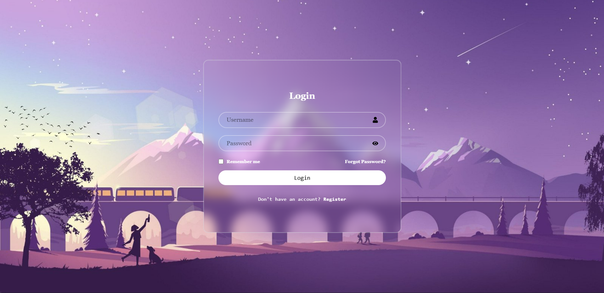
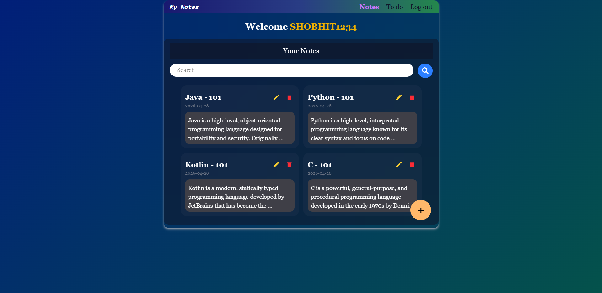
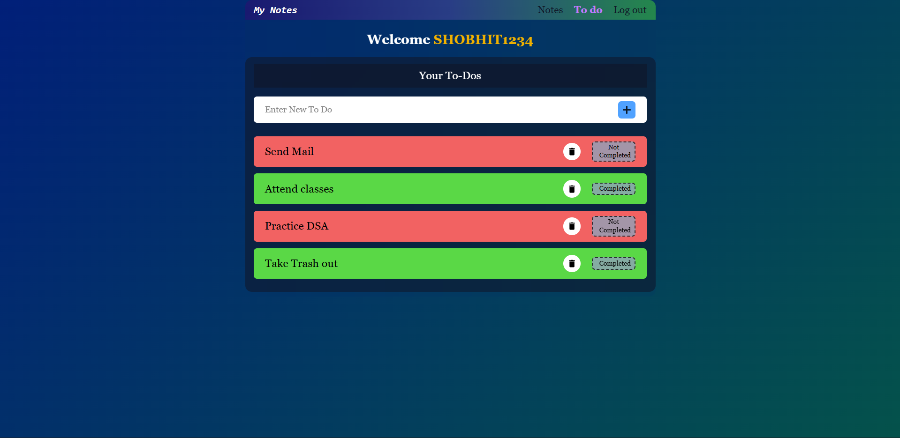

# 📝 Notes & Todo App - Frontend

## 🚀 Overview

This is the frontend for a full-stack Notes & Todo application built using React.  
It provides a clean user interface for managing notes and tasks, with secure authentication and seamless integration with the backend APIs.

---

## 🔥 Features

- User login and registration UI
- Create, update, and delete notes
- Manage todo tasks
- API integration with Spring Boot backend
- Responsive UI using Tailwind CSS


---

## 🛠 Tech Stack

- React
- Tailwind CSS
- JavaScript
- Axios (for API calls)
- Vite

---

## 🔗 Backend Repository

👉 https://github.com/Shobhit-singhal/notesApp-backend

---

## ⚙️ How to Run Locally

### 1. Clone the repository

```bash
git clone https://github.com/Shobhit-singhal/NotesApp-frontEnd
cd NotesApp-frontEnd
```

### 2. Install dependencies

```bash
npm install
```

### 3. Run the app

```bash
npm run dev
```

---

## 🌐 API Integration

- Connects to backend APIs for authentication and data management
- Uses JWT tokens for secure requests

---

## 📸 Screenshots

### 🔐 Login Page



### 📝 Notes Dashboard



### ✅ Todo Section



## 📈 Future Improvements

- Improve UI/UX design
- Add loading states and better error handling
- Deploy frontend (Vercel / Netlify)
- Add animations and transitions

---

## 👨‍💻 Author

Shobhit Singhal
